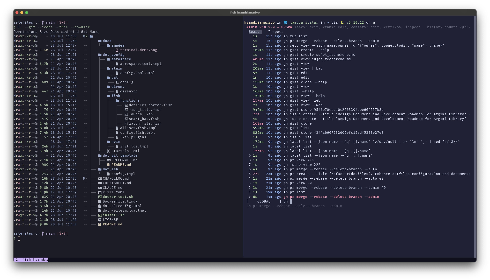

# Artefiles

A cross-platform dotfiles template that provides a **default and sane configuration for a modern development environment**. Every config it installs is **managed by [chezmoi](https://chezmoi.io/)**, so you can preview, edit, update and roll back your dotfiles with a few commands (see [Using chezmoi](#using-chezmoi)).

> One command gives you Fish, Starship and modern Rust CLI tools, preconfigured and kept up to date with `chezmoi update` — [learn the chezmoi commands](#using-chezmoi).

## Philosophy

This repository is designed to give you a **batteries-included development environment** that:
- Uses **Fish Shell** for intelligent autosuggestions and superior user experience
- Leverages **modern Rust-based Unix tools** (eza, bat, fd, rg) for better performance and UX
- Provides consistent configuration across macOS and Linux platforms
- Offers a **modular architecture**: a core layer is always installed, and additional modules are opt-in


*Modern terminal setup with Fish shell, Starship prompt, and Rust-based tools*

## Prerequisites

- A GitHub account (for git and GitHub-related features)
  - For non-interactive environments, set `GH_TOKEN` or `GITHUB_TOKEN` before installation
- SSH keys added to your GitHub account ([instructions](https://docs.github.com/en/authentication/connecting-to-github-with-ssh/generating-a-new-ssh-key-and-adding-it-to-the-ssh-agent))

After installation, you will need to change your default shell to Fish to get the full experience — see [Post-Installation Steps](#post-installation-steps).

## Quick Start

```bash
sh -c "$(curl -fsLS https://raw.githubusercontent.com/artefactory/artefiles/main/install.sh)"
```

This is the recommended path. The script:
1. Installs [GitHub CLI](https://cli.github.com/) if not already present
2. Authenticates you with GitHub (interactive browser flow, or reads a token from the environment — see below)
3. Installs [chezmoi](https://chezmoi.io/) and runs `chezmoi init --apply`

> **Why not `curl get.chezmoi.io | sh ... init --apply` directly?**
> `.chezmoi.toml.tmpl` calls `gh api user` at init time to pre-populate your name and email.
> GitHub CLI must be installed and authenticated *before* `chezmoi init` runs.
> `install.sh` enforces that order; the chezmoi-direct path does not.

### Non-interactive Environments (Codespaces / CI)

For headless environments where a browser login is not possible, set a GitHub token before running the script:

```bash
export GH_TOKEN=ghp_your_token_here
sh -c "$(curl -fsLS https://raw.githubusercontent.com/artefactory/artefiles/main/install.sh)"
```

`GITHUB_TOKEN` is also accepted and is set automatically in GitHub Actions. In Codespaces the token is already in the environment, so no extra configuration is needed beyond adding this repository as your dotfiles source.

### GitHub Codespaces

These dotfiles can automatically bootstrap your GitHub Codespace environment:

1. Add this repository as your dotfiles in your [GitHub Codespaces settings](https://github.com/settings/codespaces)
2. Create a new codespace — it will automatically apply these dotfiles using `install.sh`

Learn more about Codespaces dotfiles in the [official documentation](https://docs.github.com/en/codespaces/customizing-your-codespace/personalizing-github-codespaces-for-your-account#dotfiles).

### Manual / Advanced Installation

If you prefer to manage prerequisites yourself before running chezmoi directly:

1. Install [Homebrew](https://brew.sh/) (macOS):
   ```bash
   /bin/bash -c "$(curl -fsSL https://raw.githubusercontent.com/Homebrew/install/HEAD/install.sh)"
   ```

2. Install [GitHub CLI](https://github.com/cli/cli#installation) using your preferred method for your platform.

3. Authenticate with GitHub CLI following the [official instructions](https://cli.github.com/manual/gh_auth_login), or set `GH_TOKEN` in your environment.

4. Install these dotfiles directly with chezmoi:
   ```bash
   sh -c "$(curl -fsLS get.chezmoi.io)" -- -b $HOME/.local/bin init --apply artefactory/artefiles
   ```

## Using chezmoi

Chezmoi manages every config file of these dotfiles: the source lives in the directory printed by `chezmoi source-path` and `chezmoi apply` writes it to your home directory. Main docs: https://www.chezmoi.io/user-guide/command-overview/

| Task | Command |
|------|---------|
| See pending changes | `chezmoi status` |
| Inspect diffs | `chezmoi diff` |
| Edit a file | `chezmoi edit ~/.config/fish/config.fish` |
| Apply changes | `chezmoi apply` |
| Update from repo | `chezmoi update` |
| Re-run the module prompt and apply | `chezmoi init && chezmoi apply` |

### Remove All Chezmoi-Managed Files (Danger)

Review first:
```bash
chezmoi managed -p absolute
```

Remove all managed files, then remove chezmoi state/source:
```bash
chezmoi managed -p absolute -0 | xargs -0 chezmoi destroy --force
chezmoi purge --force
```

## Clone and personalize

To make these dotfiles your own while still receiving upstream updates:

1. **Fork** [artefactory/artefiles](https://github.com/artefactory/artefiles) on GitHub (or clone it and push to your own repository).
2. Initialize chezmoi from your fork:
   ```bash
   chezmoi init --apply <your-user>/artefiles
   ```
   From a local clone, run `./install.sh` inside it instead: it uses the checkout as the chezmoi source.
3. Edit a managed file with `chezmoi edit ~/.config/fish/config.fish`, then review with `chezmoi diff` and apply with `chezmoi apply`.
4. Commit and push your changes from the source directory (`chezmoi cd`). `chezmoi update` pulls from your fork.
5. Keep upstream updates: add the original repository as `upstream` once, then merge it when you want the latest changes (the global git config already uses mergiraf for structured merges):
   ```bash
   git -C "$(chezmoi source-path)" remote add upstream https://github.com/artefactory/artefiles.git
   git -C "$(chezmoi source-path)" fetch upstream
   git -C "$(chezmoi source-path)" merge upstream/main
   chezmoi apply
   ```

## Modular Architecture

Artefiles uses a **core + opt-in modules** design. During `chezmoi init`, you select which modules to enable via an interactive prompt.

### Core (always installed)

Fish, Starship, Git, bat, eza, fd, fzf, ripgrep, zoxide, rip2, dust, bottom, direnv, uv, Rust, FiraCode Nerd Font.

### Optional Modules

| Module | Description | Alternative to |
|--------|-------------|----------------|
| `editor` | Neovim: modal terminal editor with the team configuration (nvim) | — |
| `ghostty` | Ghostty terminal, preconfigured, plus Zellij (panes and tabs). Alternative to cmux: pick one | `cmux` |
| `cmux` | cmux: Ghostty-based macOS terminal, vertical tabs, agent notifications. Alternative to ghostty: pick one | `ghostty` |
| `git_advanced` | Extra git tools: difftastic (diffs), git-cliff (changelogs), git-lfs, git-extras, tuicr (review TUI) | — |
| `atuin` | Atuin: searchable shell history, synced across machines (Ctrl+R) | — |
| `python_dev` | Python tools: nbdime (notebook diffs), VS Code extensions | — |
| `pre_commit` | pre-commit: Git hook manager running linters and formatters on commit. Alternative to prek: pick one | `prek` |
| `prek` | prek: faster Rust drop-in for pre-commit, same config. Alternative to pre_commit: pick one | `pre_commit` |
| `gcloud` | Google Cloud SDK: the gcloud CLI to manage Google Cloud resources | — |
| `colima` | Colima: lightweight container runtime for Docker (macOS only) | — |
| `terraform` | Terraform: infrastructure-as-code CLI to plan and apply cloud resources. Alternative to opentofu: pick one | `opentofu` |
| `opentofu` | OpenTofu: open-source fork of Terraform, same workflow (tofu). Alternative to terraform: pick one | `terraform` |

> The `terminal` module is now called `ghostty` (an existing `terminal` selection is renamed on the next `chezmoi init`). The `multiplexer` module is gone: Zellij now comes with `ghostty`, so select `ghostty` to keep it. `cmux` does not install Zellij.

### Changing Modules

Re-run `chezmoi init` to update your module selection, then `chezmoi apply`.

## What's Included

### Core Features

- 🐟 **[Fish Shell](https://fishshell.com/)** - A smart command-line shell that suggests commands as you type and has better tab completion than traditional shells
- ⚡ **[Starship](https://starship.rs/)** - A customizable terminal prompt that shows useful information like git status, programming language versions, and execution time
- 🔍 **Modern CLI Tools** - Faster, more user-friendly replacements for traditional Unix commands:
  - `bat` - Enhanced version of `cat` with syntax highlighting and line numbers
  - `eza` - Better `ls` with colors, git status, and tree view
  - `fd` - Faster, easier-to-use alternative to `find` for searching files
  - `fzf` - Fuzzy finder for quickly searching through files and command history. Also rebound onto Tab as the completion picker: every fish completion — commands, subcommands, flags, and flag values — opens in fzf instead of fish's native pager, with live re-filtering as you type
  - `rip` - Safe `rm` replacement with a recoverable graveyard
  - `ripgrep` - Lightning-fast text search across files
- 🌟 **[Catppuccin](https://github.com/catppuccin/catppuccin)** - A beautiful, consistent color theme applied across all tools for a cohesive look

### Optional Module Highlights

- 📝 **[Neovim](https://neovim.io/)** (`editor`) - A powerful text editor with syntax highlighting, plugins, and modern features
- 🔄 **Advanced Git** (`git_advanced`) - [difftastic](https://github.com/Wilfred/difftastic), [git-cliff](https://git-cliff.org/), [Git LFS](https://git-lfs.com/), [git-extras](https://github.com/tj/git-extras) (~80 helper subcommands like `git summary`, `git undo`, `git ignore`, `git wip`), and [tuicr](https://tuicr.dev/) - a vim-keybinding code review TUI (works with git), wired up as the `review` fish command: `review` (uncommitted changes), `review file <path>`, `review branch [base]`, `review commit [rev]`, `review pr <n>`, `review list`, `review comments` — `review <Tab>` opens the fzf picker with a description for each
- 📊 **Jupyter Notebook Support** (`python_dev`) - nbdime via uv
- 🪝 **Git Hooks** (`pre_commit` or `prek`) - [pre-commit](https://pre-commit.com/), or [prek](https://github.com/j178/prek), a faster Rust drop-in replacement (choose one); installed with uv, and the global hooks in `~/.git_template` make every new repository run its `.pre-commit-config.yaml`
- 🐋 **Container Development** (`cloud`) - [Colima](https://github.com/abiosoft/colima) for running Docker containers on macOS without Docker Desktop
- ⏰ **Shell History** (`atuin`) - [Atuin](https://atuin.sh/) syncs your command history across machines with powerful search
- 📁 **Smart Navigation** - [Zoxide](https://github.com/ajeetdsouza/zoxide) learns your most-used directories for instant navigation

## What Files Will Be Created/Modified

⚠️ **Important**: These dotfiles do NOT modify your shell startup files (.profile, .zprofile, etc.). To benefit from the Fish shell configuration, make Fish your default shell: `install.sh` offers to do it as its last step, or you can do it yourself (see [Post-Installation Steps](#post-installation-steps)).

### Git Configuration
- `~/.gitconfig` - Git configuration with modern defaults ([Git Documentation](https://git-scm.com/docs/git-config))
- `~/.gitattributes_global` - Global attributes for merge drivers and file handling

### Terminal Configuration
- `~/.config/ghostty/config` - Ghostty terminal configuration ([Ghostty Documentation](https://ghostty.org/)) (requires the `ghostty` or `cmux` module)

### VS Code Configuration
VS Code is not installed by this setup; these files apply when you install it yourself. The extension install is skipped when the `code` CLI is missing, and the Python extensions (Python, Pylance, Ruff) install only with the `python_dev` module.

- `~/.config/Code/User/settings.json` *(Linux)* — Default VS Code settings (Catppuccin theme, FiraCode font, fish terminal, Ruff formatter). Created on first apply only; your edits are never overwritten on `chezmoi update`.
- `~/Library/Application Support/Code/User/settings.json` *(macOS)* — Same default VS Code settings as the Linux path above. Created on first apply only; never overwritten on `chezmoi update`.

### Fish Shell Configuration ([Fish Shell Documentation](https://fishshell.com/docs/current/))
- `~/.config/fish/config.fish` - Main Fish shell configuration
- `~/.config/fish/aliases.fish` - Shell aliases and functions
- `~/.config/fish/conf.d/artefiles_abbrs.fish` - Fish abbreviations managed by chezmoi
- `~/.config/fish/fish_plugins` - Fish plugin list
- `~/.config/fish/functions/fish_title.fish` - Terminal title function
- `~/.config/fish/functions/smart_bat.fish` - Enhanced bat function (VSCode-aware)
- `~/.config/fish/functions/dotfiles_doctor.fish` - Health check function
- `~/.config/fish/functions/fuzzy_complete.fish` - Tab completion picker backed by fzf, plus its helpers (`_fuzzy_complete_render.fish`, `_fuzzy_complete_insert.fish`, `__cached_init.fish`)
- `~/.config/fish/completions/cd.fish` - Zoxide-ranked `cd` completions, with an unambiguous-jump shortcut that skips the picker
- `~/.config/fish/conf.d/direnv.fish` - Defers direnv's shell hook to the first prompt instead of every startup
- `~/.config/fish/functions/review.fish` and `~/.config/fish/completions/review.fish` - The `review` command wrapping tuicr (requires `git_advanced` module)
- `~/.config/fish/functions/__atuin_fzf_search.fish` and `~/.config/fish/scripts/atuin_fzf_list.sh` - Atuin history rendered through fzf, bound to Ctrl+R/Alt+R/Alt+F (requires `atuin` module and `perl`, present by default on macOS and mainstream Linux distros)

### Shell Prompt
- `~/.config/starship.toml` - Shell prompt configuration ([Starship Documentation](https://starship.rs/))

#### Customizing Starship
- [Configuration guide](https://starship.rs/config/) - module reference and syntax
- [Presets gallery](https://starship.rs/presets/) - ready-made prompt styles
- [Catppuccin theme](https://github.com/catppuccin/starship) - palette currently in use

### Development Tools
- `~/.config/bat/config` - Syntax highlighter configuration ([Bat Documentation](https://github.com/sharkdp/bat))
- `~/.config/direnv/direnvrc` - Environment management ([Direnv Documentation](https://direnv.net/))
- `~/.config/uv/uv.toml` - Python package manager configuration ([uv Documentation](https://docs.astral.sh/uv/))
- `~/.config/atuin/config.toml` - Shell history sync ([Atuin Documentation](https://atuin.sh/)) (requires `atuin` module)
- `~/.config/tuicr/config.toml` - Code review TUI configuration ([tuicr Documentation](https://tuicr.dev/)) (requires `git_advanced` module)
- `~/.config/nvim/init.lua` - Neovim editor configuration ([Neovim Documentation](https://neovim.io/doc/)) (requires `editor` module)

## Common Tasks

| Task | Command |
|------|---------|
| Update dotfiles | `chezmoi update` |
| Edit config | `chezmoi edit <path>` |
| Health check | `dotfiles_doctor` |
| New Python project | `mkdir project && cd project && echo 'layout uv' > .envrc && direnv allow` |

## Configuration Structure

```
~/.config/
  ├── atuin/           # Shell history sync (atuin module)
  ├── bat/             # Syntax highlighting
  ├── direnv/          # Environment management
  ├── fish/            # Shell configuration
  │   ├── config.fish  # Main shell configuration
  │   ├── aliases.fish # Shell aliases and functions
  │   └── functions/   # Custom fish functions
  ├── ghostty/         # Terminal emulator (ghostty or cmux module)
  ├── nvim/            # Editor configuration (editor module)
  ├── uv/              # Python package manager
  └── starship.toml    # Prompt configuration

~/.gitconfig           # Git configuration
```

## Post-Installation Steps

### 1. Change Default Shell to Fish (Required for Full Experience)

`install.sh` asks as its very last step whether to make Fish your default shell. Changing it runs `sudo` and `chsh`, so the default answer is No, and nothing is asked in CI, in Codespaces or without a terminal. `chezmoi apply` itself never changes your shell.

If you declined, or installed with `chezmoi init --apply` directly, set Fish as your default login shell yourself:

**macOS:**
```bash
command -v fish | sudo tee -a /etc/shells
chsh -s $(brew --prefix)/bin/fish
```

**Linux:**
```bash
chsh -s $(which fish)
```

You may need to log out and back in for the shell change to take effect. If you're using VS Code or another IDE, fully quit and reopen it so the Fish profile shows up in the terminal list.

### 2. Set up shell history sync

```bash
atuin register  # New account
atuin login     # Existing account
```

### 3. Initialize cloud tools (if needed)

```bash
gcloud init  # Set up Google Cloud SDK
```

### 4. Restart your terminal or IDE

Restart your terminal (or fully quit and reopen your IDE if using VS Code, Cursor, etc.) for all changes to take effect.

## Try it in a sandbox

To simulate a new user's install without touching your own machine:

```bash
./sandbox.sh                                   # the whole install, interactively, then a shell in the sandbox
./sandbox.sh --gh-token                        # same, lending your gh token so GitHub answers for real
./sandbox.sh --modules atuin,editor            # skip the install and prompts, seed these modules
./sandbox.sh --modules editor --command 'ls -a "$HOME/.config"'
./sandbox.sh --clean                           # remove the leftovers of earlier runs
```

By default it runs the real `install.sh` inside a temporary home: the gh check and login, chezmoi, its prompts and the files applied from your checkout. Every side effect on your machine is stubbed and listed at the end as `(sandbox) would run: ...`: brew, downloads, the gh login, `sudo`, `chsh`, and chezmoi's scripts and externals, so nothing is installed and your real configuration is never read or written. Without `--gh-token` (or `GH_TOKEN`), `gh` is logged out as for a brand-new user, and the login is only simulated. `--keep` leaves the sandbox on disk and `--clean` removes the leftovers of earlier runs, including after a crash; a normal exit or Ctrl-C removes it by itself.

After the install it lists the scripts chezmoi would run, and on Linux the externals it would download (rendered from the real template), so module installs can be reviewed without running them. What it does not exercise: the Quick Start clone path (the sandbox always has the checkout) and a `gh` that is not installed yet. `curl`, `wget`, `sudo` and `chsh` are stubbed and no tool is installed in the sandbox, so its shell can print missing-command messages a real user would not see. For a full Linux install in a container, run `./docker-test.sh`.

## Need Help?

- Run `dotfiles_doctor` to check your installation
- See `chezmoi help` for dotfiles management
- Check the [CHEATSHEET.md](CHEATSHEET.md) for more commands
- Reset a file: `chezmoi apply --force <path>`

## Detailed Documentation

- [CHEATSHEET.md](CHEATSHEET.md) - Common commands and shortcuts
- [CHANGELOG.md](CHANGELOG.md) - Version history and updates

## License

MIT
